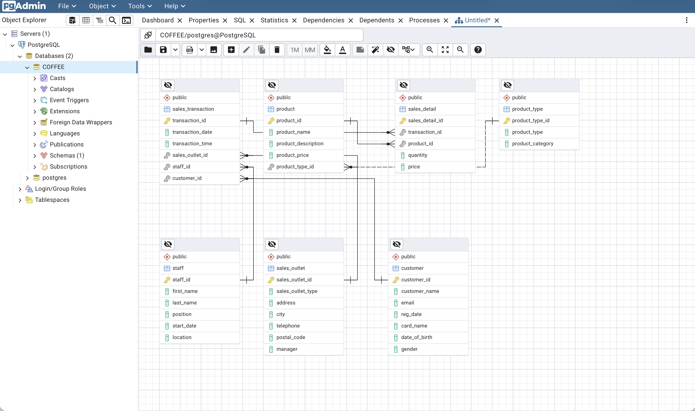

# Database Design & Implementation: Coffee Shop Data Integration

Designed and implemented a normalized relational schema for a multi-location coffee shop chain. Consolidate data from accounting software, supplier databases, spreadsheets, and POS exports into a central PostgreSQL database; publish stakeholder-specific subsets via views/materialized views; and deliver extracts into MySQL for external partners.

## Key Features
- **Data modeling**: entities, attributes, ERD, keys & relationships; normalized to 2NF. 
- **Schema build**: generate SQL from ERD; load sample data. 
- **Operational subsets**: 
    - `staff_locations_view` for payroll export.
    - `product_info_m-view` materialized view for marketing.

## Tech Stack
- **Databases**: PostgreSQL, MySQL
- **Tools**: ERD modeling, pgAdmin, phpMyAdmin
- **Languages**: SQL (DDL, DML)

## Database Logical Design
The logical design was captured in an Entity-Relationship Diagram (ERD) to model entities, attributes, and relationships before implementing the schema.  

- **Entities**: sales_transaction, product, sales_detail, product_type, staff, sales_outlet, customer
- **Relationships**: 
  - sales_transaction ↔ sales_detail (1-to-many)  
  - sales_transaction ↔ sales_outlet (many-to-1) 
  - sales_transaction ↔ staff (many-to-1)  
  - sales_transaction ↔ customer (many-to-1) 
  - product ↔ sales_detail (1-to-many) 
  - product ↔ product_type (many-to-1)   

### Normalization Decisions

Two tables were normalized to **Second Normal Form (2NF):**

1. **sales_transaction → sales_transaction + sales_detail**
   - Problem: `sales_transaction` contained repeating product columns for multi-item orders.  
   - Fix: Split into:
     - `sales_transaction` 
     - `sales_detail` 
   - Benefit: Removes redundancy and supports 1-to-many relationships between transactions and products.

2. **product → product + product_type**
   - Problem: `product` table had repeated category/type attributes across rows.  
   - Fix: Split into:
     - `product` 
     - `product_type` 
   - Benefit: Eliminates redundant storage of product type and categories, improves maintainability.

## How to Reproduce (Optional)
If you wish to run:
1) Create DB `COFFEE` in PostgreSQL.  
2) Run `sql/GeneratedScript.sql` → then `sql/CoffeeData.sql`.  
3) Create views using the provided SQL files.  
4) (Optional) Export CSVs for downstream systems as in the original tasks. 

> This repository focuses on code & design artifacts for review. Running the database is optional.